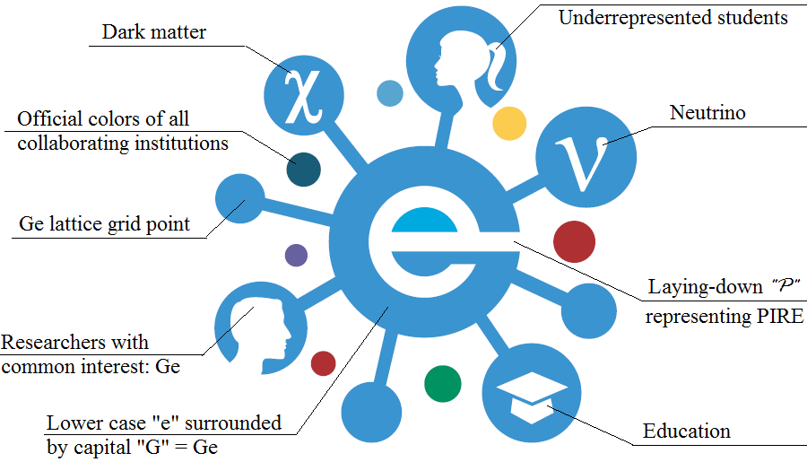
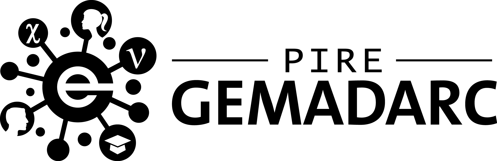

---
---

# Logo guide

The PIRE-GEMADARC logo was designed by [ouredi](https://www.freelancer.com/u/ouaredi.html) @ [freelancer.com](https://www.freelancer.com) together with GEMADARC collaborators. The Intellectual Property (IP) ownership has been transferred to PIRE-GEMADARC. The signed IP Transfer Agreement is available [here](https://drive.google.com/uc?id=0BwM7XYhFgK7ob1FFdURXYURIcEU). GEMADARC collaborators can choose any of the following variations of the logo in their research or outreach activities related to GEMADARC.

## Design concept

----

## Favicon

32x32: 
16x16: 

----

## Logo without text

----

## Logo with text

